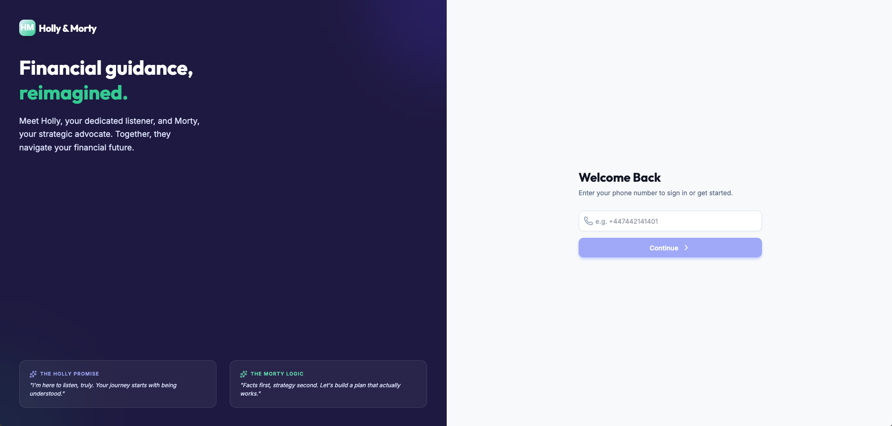
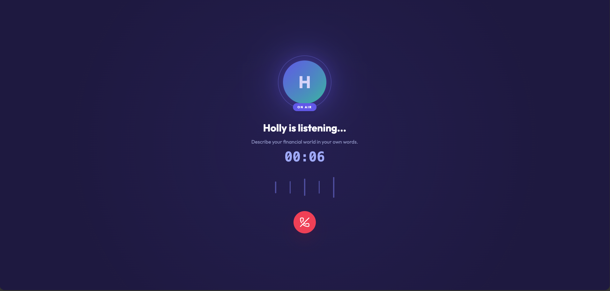
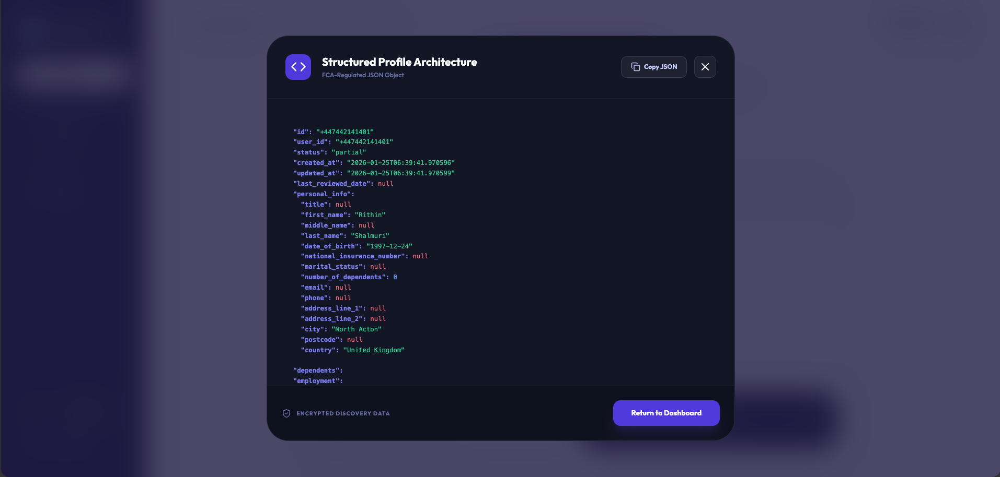
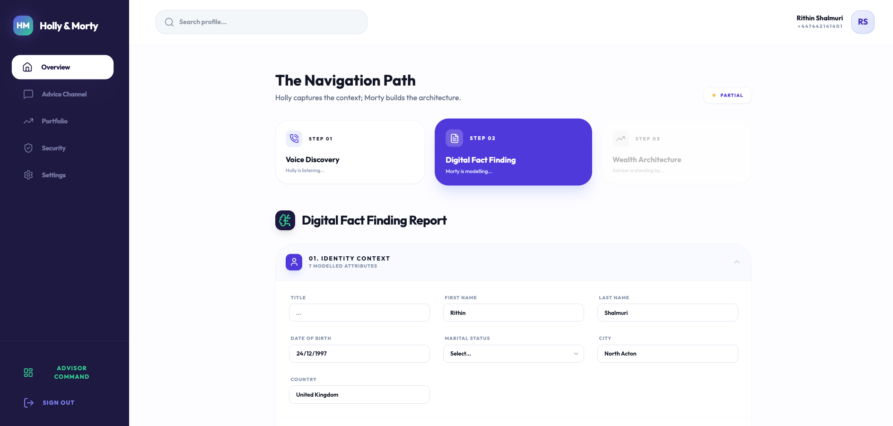
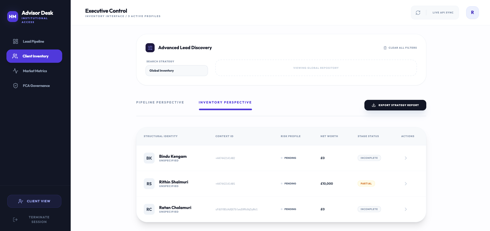

<div align="center">
  
</div>

# 🎙️ Holly and Morty

> ✨ Conversational Agents for Wealth Advisors

[](https://fastapi.tiangolo.com)
[](https://www.python.org)
[](https://azure.microsoft.com/en-us/services/cosmos-db/)
[](https://www.anthropic.com)
[](https://www.docker.com)

Holly and Morty is a platform that processes voice conversations from ElevenLabs conversational AI agents, extracts structured financial profiles using Claude AI, and provides a comprehensive REST API for managing conversations and client data.

## � Built for Saturn & EF | Build the Next Decade Hackathon

**Track 2: Build AI Systems that Solve Underserved Problems**

> *Build systems that solve painful, underserved, and specific problems, delivering clear, immediate value to a real user. AI must meaningfully improve the outcome, not just be bolted on.*

### The Problem

Comprehensive financial advice—the kind that actually changes lives—is only available to the wealthy. The financial advisory industry manages over **$40 trillion in assets** and generates **$100 billion+ in annual revenue**, yet the vast majority of people who need financial guidance will never get it.

**Why?** Because the economics are broken.

A single financial adviser can only serve ~100-150 clients. Advisers spend **70% of their time on administration and compliance**—not actually helping people. The assembly line of financial advice is held together with duct tape, manual processes, and spreadsheets.

### The Solution: Holly & Morty

Holly & Morty targets **Stage 1 & 2** in the financial advice assembly pipeline:

#### 🎙️ **Holly** - The Listener
Voice-based conversational AI agent that:
- **Conducts data gathering conversations** with clients
- **Extracts Letters of Authority (LOA)** information
- **Performs compliant fact-finding** interviews
- **Understands client goals, risk tolerance, and circumstances**

#### 🤖 **Morty** - The Supporter
AI-powered extraction and support system that:
- **Provides targeted support** (FCA regulation compliant, not advice)
- **Extracts structured data** from conversations automatically
- **Eliminates manual data entry** and repetitive administrative work
- **Generates prospect leads** for advisor dashboards

### The Impact

**What currently takes 4-8 hours per client** (data gathering and fact-finding) is reduced to minutes through intelligent voice agents and automated extraction.

This isn't AI bolted on—it's AI **meaningfully improving outcomes** by:
- **Cutting repetitive work** for advisors and paraplanners by 70%
- **Making financial advice accessible** to people who can't afford traditional services
- **Freeing advisors** to focus on actual advice, not paperwork
- **Scaling expertise** from 100 clients per advisor to potentially thousands

### The Vision: Financial Advice for a Billion People

By making the assembly line of financial advice **10x more efficient**, we can democratize access to financial guidance. Holly & Morty is the first step toward a future where comprehensive financial advice isn't a luxury—it's a right.

## �🌟 Features

- **🎯 ElevenLabs Voice Agent Integration** - Real-time webhook processing for post-call transcriptions
- **🤖 AI-Powered Profile Extraction** - Automated extraction of financial profiles using Anthropic Claude
- **💾 Multi-Container Cosmos DB** - Scalable NoSQL storage for conversations, profiles, and insights
- **📊 Comprehensive REST API** - Full CRUD operations with advanced search and filtering
- **📈 Serverless Architecture** - Cost-effective Azure Cosmos DB serverless deployment
- **🎨 Interactive API Docs** - Beautiful Scalar documentation interface
- **🐳 Docker Ready** - Containerized deployment with environment-based configuration
- **🔍 Advanced Querying** - Search by status, date ranges, employment, risk profile, net worth, and more
## 🌐 Live Demo

**🚀 Access the deployed application:** [https://holly-morty-financial-navigation-907277113728.us-west1.run.app](https://holly-morty-financial-navigation-907277113728.us-west1.run.app)

### 📸 Application Screenshots

#### Profile Details & Extraction
Detailed client profile view showing AI-extracted financial information from voice conversations with Holly.

<div align="center">
  
</div>

#### Profile Details & Extraction
Detailed client profile view showing AI-extracted financial information from voice conversations with Holly.

<div align="center">
  
</div>

<div align="center">
  
</div>

#### User Dashboard
The user dashboard provides a comprehensive view of financial profile status, conversations, and personalized insights.

<div align="center">
  
</div>

#### Advisor Dashboard - Pipeline View
Advisors can view and manage all client profiles with advanced filtering by status, risk profile, employment, net worth, and more.

<div align="center">
  
</div>


#### Advanced Filtering & Search
Search capabilities to filter clients by name, status, risk attitude, employment status, income range, and net worth.

<div align="center">
  
</div>
## 🏗️ Architecture

```
┌─────────────────┐
│  ElevenLabs     │
│  Voice Agent    │
└────────┬────────┘
         │ Webhook
         ▼
┌─────────────────────────────────────────┐
│         Holly & Morty API               │
│  ┌─────────────────────────────────┐   │
│  │  FastAPI + Scalar Docs          │   │
│  └─────────────┬───────────────────┘   │
│                │                         │
│  ┌─────────────▼───────────────────┐   │
│  │  Profile Extraction Service     │   │
│  │  (Anthropic Claude Sonnet)      │   │
│  └─────────────┬───────────────────┘   │
│                │                         │
│  ┌─────────────▼───────────────────┐   │
│  │   Azure Cosmos DB (NoSQL)       │   │
│  │  ┌──────────────────────────┐   │   │
│  │  │ Conversations Container  │   │   │
│  │  └──────────────────────────┘   │   │
│  │  ┌──────────────────────────┐   │   │
│  │  │  Profiles Container      │   │   │
│  │  └──────────────────────────┘   │   │
│  │  ┌──────────────────────────┐   │   │
│  │  │  Insights Container      │   │   │
│  │  └──────────────────────────┘   │   │
│  └─────────────────────────────────┘   │
└─────────────────────────────────────────┘
```

## 🛠️ Tech Stack

| Category | Technology |
|----------|-----------|
| **API Framework** | FastAPI 0.109.0 |
| **Python Runtime** | Python 3.11+ |
| **Database** | Azure Cosmos DB (NoSQL, Serverless) |
| **AI/LLM** | Anthropic Claude 3.5 Sonnet |
| **Voice AI** | ElevenLabs Conversational AI |
| **API Documentation** | Scalar FastAPI |
| **Validation** | Pydantic v2 |
| **Containerization** | Docker |
| **HTTP Client** | HTTPX 0.27.2 |
| **ASGI Server** | Uvicorn 0.27.0 |

## 📡 API Endpoints

### Core Endpoints

| Method | Endpoint | Description |
|--------|----------|-------------|
| `GET` | `/` | Root endpoint with API information |
| `GET` | `/health` | Health check endpoint |
| `GET` | `/docs` | Interactive API documentation (Scalar) |

### Webhook Endpoints

| Method | Endpoint | Description |
|--------|----------|-------------|
| `POST` | `/webhooks/holly-conversation` | ElevenLabs post-call transcription webhook |

### Conversations API

| Method | Endpoint | Description | Query Parameters |
|--------|----------|-------------|------------------|
| `GET` | `/conversations/` | Get all conversations | `limit`, `offset`, `user_id` |
| `GET` | `/conversations/{conversation_id}` | Get conversation by ID | - |
| `GET` | `/conversations/user/{user_id}` | Get all conversations for user | `limit`, `offset` |
| `GET` | `/conversations/search/by-status` | Search by conversation status | `status`, `limit`, `offset` |
| `GET` | `/conversations/search/by-agent` | Search by agent ID | `agent_id`, `limit`, `offset` |
| `GET` | `/conversations/search/by-date-range` | Search by date range | `start_timestamp`, `end_timestamp`, `limit`, `offset` |

### Profiles API

| Method | Endpoint | Description | Query Parameters |
|--------|----------|-------------|------------------|
| `POST` | `/profiles/` | Create new profile | Body: `user_id`, `first_name`, `last_name` |
| `GET` | `/profiles/` | Get all profiles | `limit`, `offset`, `status` |
| `GET` | `/profiles/{user_id}` | Get profile by user ID | - |
| `PUT` | `/profiles/{user_id}` | Update profile | Body: Partial profile data |
| `GET` | `/profiles/search/by-name` | Search by name | `name`, `limit`, `offset` |
| `GET` | `/profiles/search/by-status` | Search by profile status | `status`, `limit`, `offset` |
| `GET` | `/profiles/search/by-employment` | Search by employment status | `employment_status`, `limit`, `offset` |
| `GET` | `/profiles/search/by-net-worth-range` | Search by net worth | `min_net_worth`, `max_net_worth`, `limit`, `offset` |
| `GET` | `/profiles/search/by-risk-attitude` | Search by risk attitude | `risk_attitude`, `limit`, `offset` |
| `GET` | `/profiles/search/by-income-range` | Search by income | `min_income`, `max_income`, `limit`, `offset` |

## 🚀 Getting Started

### Prerequisites

- Python 3.11 or higher
- Docker (optional, for containerized deployment)
- Azure Cosmos DB account
- Anthropic API key
- ElevenLabs account with Conversational AI

### Local Development

1. **Clone the repository**
   ```bash
   git clone https://github.com/rithinch/holly-and-morty.git
   cd holly-and-morty/api
   ```

2. **Create virtual environment**
   ```bash
   python -m venv venv
   source venv/bin/activate  # On Windows: venv\Scripts\activate
   ```

3. **Install dependencies**
   ```bash
   pip install -r requirements.txt
   ```

4. **Configure environment variables**
   ```bash
   cp .env.example .env
   ```
   
   Edit `.env` with your credentials:
   ```env
   # API Configuration
   API_TITLE=Holly and Morty API
   API_VERSION=1.0.0
   
   # ElevenLabs
   ELEVENLABS_WEBHOOK_SECRET=your_webhook_secret
   
   # Azure Cosmos DB
   COSMOS_CONNECTION_STRING=your_cosmos_connection_string
   COSMOS_DATABASE_NAME=holly-morty-db
   
   # Anthropic AI
   ANTHROPIC_API_KEY=your_anthropic_api_key
   ```

5. **Run the application**
   ```bash
   uvicorn main:app --reload
   ```

6. **Access the API**
   - API: http://localhost:8000
   - Documentation: http://localhost:8000/docs
   - Health Check: http://localhost:8000/health

### Docker Deployment

1. **Build the Docker image**
   ```bash
   cd api
   docker build -t holly-and-morty-api .
   ```

2. **Run with environment file**
   ```bash
   docker run -p 8000:8000 --env-file .env holly-and-morty-api
   ```

3. **Run with inline environment variables**
   ```bash
   docker run -p 8000:8000 \
     -e ELEVENLABS_WEBHOOK_SECRET=your_secret \
     -e COSMOS_CONNECTION_STRING=your_cosmos_string \
     -e ANTHROPIC_API_KEY=your_anthropic_key \
     holly-and-morty-api
   ```

## 🔄 CI/CD Pipeline

### GitHub Actions Workflow

The project includes automated CI/CD pipelines for continuous integration and deployment.

#### Continuous Integration (CI)

```yaml
name: CI

on: [push, pull_request]

jobs:
  test:
    runs-on: ubuntu-latest
    steps:
      - uses: actions/checkout@v3
      - name: Set up Python
        uses: actions/setup-python@v4
        with:
          python-version: '3.11'
      - name: Install dependencies
        run: |
          cd api
          pip install -r requirements.txt
      - name: Run tests
        run: |
          cd api
          pytest
```

#### Continuous Deployment (CD)

```yaml
name: Deploy to Azure

on:
  push:
    branches: [main]

jobs:
  deploy:
    runs-on: ubuntu-latest
    steps:
      - uses: actions/checkout@v3
      - name: Build Docker image
        run: |
          cd api
          docker build -t holly-and-morty-api .
      - name: Push to Azure Container Registry
        run: |
          # Add your ACR push commands here
      - name: Deploy to Azure Container Apps
        run: |
          # Add your Azure deployment commands here
```

### Environment Setup for CI/CD

Add the following secrets to your GitHub repository:

- `ELEVENLABS_WEBHOOK_SECRET`
- `COSMOS_CONNECTION_STRING`
- `ANTHROPIC_API_KEY`
- `AZURE_CREDENTIALS` (for Azure deployment)

## 📊 Data Models

### Financial Profile

The system extracts comprehensive financial profiles from conversations:

```python
{
  "user_id": "string",
  "status": "incomplete | in_progress | complete",
  "personal_info": {
    "first_name": "string",
    "last_name": "string",
    "date_of_birth": "YYYY-MM-DD",
    "nationality": "string",
    "marital_status": "single | married | divorced | widowed",
    "number_of_dependents": 0
  },
  "employment": {
    "employment_status": "employed | self_employed | unemployed | retired",
    "employer_name": "string",
    "job_title": "string",
    "years_in_current_role": 0,
    "total_annual_income": 0.0
  },
  "financial_position": {
    "total_assets": 0.0,
    "total_liabilities": 0.0,
    "net_worth": 0.0
  },
  "risk_profile": {
    "risk_attitude": "very_low | low | medium | high | very_high",
    "time_horizon": "short_term | medium_term | long_term"
  },
  "completeness_percentage": 0.0
}
```

### Conversation

```python
{
  "conversation_id": "string",
  "user_id": "string",
  "agent_id": "string",
  "status": "string",
  "transcript": [...],
  "metadata": {...},
  "created_at": "ISO-8601",
  "updated_at": "ISO-8601"
}
```

## 🔐 Security

- **Webhook Verification**: HMAC-SHA256 signature validation
- **Environment Variables**: Sensitive data stored in environment variables
- **Azure Cosmos DB**: Encrypted at rest and in transit
- **API Keys**: Secure management of Anthropic and ElevenLabs credentials
- **Input Validation**: Pydantic models for request/response validation

## 🧪 Testing

### Test Webhook Locally

Use ngrok to expose your local server:

```bash
# Terminal 1: Start the API
uvicorn main:app --reload

# Terminal 2: Start ngrok
ngrok http 8000
```

Configure the ngrok URL in your ElevenLabs dashboard.

### Example Health Check

```bash
curl http://localhost:8000/health
```

Response:
```json
{
  "status": "healthy",
  "service": "holly-and-morty-api"
}
```

## 📁 Project Structure

```
holly-and-morty/
├── api/
│   ├── main.py                    # FastAPI application entry point
│   ├── core/
│   │   ├── config.py             # Configuration and settings
│   │   └── cosmos.py             # Cosmos DB client (multi-container)
│   ├── models/
│   │   ├── elevenlabs.py         # ElevenLabs webhook models
│   │   └── profile.py            # Financial profile models
│   ├── routers/
│   │   ├── webhooks.py           # Webhook endpoints
│   │   ├── conversations.py      # Conversations CRUD API
│   │   └── profiles.py           # Profiles CRUD API
│   ├── services/
│   │   └── profile_extraction.py # Claude AI profile extraction
│   ├── requirements.txt          # Python dependencies
│   ├── Dockerfile               # Docker configuration
│   ├── .env.example             # Environment template
│   ├── .gitignore              # Git ignore rules
│   └── README.md               # API documentation
└── README.md                   # This file
```

## 🤝 Contributing

Contributions are welcome! Please feel free to submit a Pull Request.

1. Fork the repository
2. Create your feature branch (`git checkout -b feature/AmazingFeature`)
3. Commit your changes (`git commit -m 'Add some AmazingFeature'`)
4. Push to the branch (`git push origin feature/AmazingFeature`)
5. Open a Pull Request

## 📝 License

This project is licensed under the MIT License - see the [LICENSE](LICENSE) file for details.

## 🙏 Acknowledgments

- **FastAPI** - Modern, fast web framework for building APIs
- **Anthropic Claude** - Advanced AI for intelligent profile extraction
- **ElevenLabs** - Conversational AI voice agents
- **Azure Cosmos DB** - Globally distributed, multi-model database
- **Scalar** - Beautiful API documentation

## 📞 Support

For issues, questions, or contributions, please open an issue on GitHub.

---

**Built with ❤️ using FastAPI, Azure Cosmos DB, and Claude AI**
